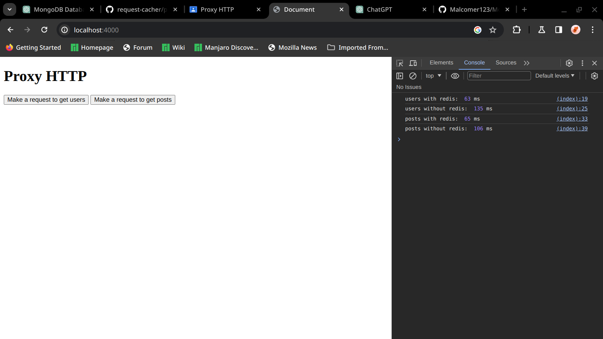

# RAPPORT SUR PERFORMANCE DE CACHING AVEC REDIS

Redis utilise la RAM pour stocker ses données avec une date d'expiration, ce qui le rend plus rapide par rapport à la récupération de données depuis une API réelle. Bien que le stockage des données dans MongoDB soit également plus rapide par rapport à l'exercice précédent, Redis surpasse tous les autres outils en termes de mise en cache.

## mongoServer

Le dossier du serveur MongoDB contient du code Express dédié à l'interrogation **d'une base de données locale MongoDB**. Ce code est spécifiquement conçu pour récupérer des données, et il les transmet ensuite à travers deux points d'accès distincts configurés en mode GET :
* **/users?id=** 
* **/posts?id=**

Ces points d'accès permettent respectivement d'obtenir des informations sur les utilisateurs et les publications en fonction de l'identifiant spécifié dans la requête. En résumé, cette implémentation Express facilite l'accès et la transmission de données depuis la base de données MongoDB locale vers les clients qui interagissent avec les points de terminaison.

## proxyServer

Ce dossier contient du code Express qui accepte les requêtes GET pour les utilisateurs et les publications, puis les transmet au serveur MongoDB. Avant d'envoyer les requêtes au serveur MongoDB, il vérifie si les données sont répertoriées en cache à l'aide de Redis grâce à un middleware. Si les données existent, il les renvoie sans envoyer la requête au backend. Cependant, si elles n'existent pas, il envoie la requête à MongoDB, stocke les données collectées dans Redis et les répertorie dans le client.

## Performance

# Crée par Achraf HAMMI, GLSID2
